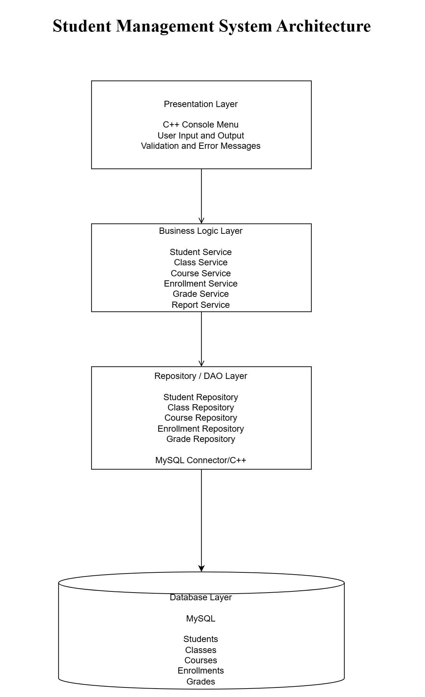

# Student Management System Architecture

## 1. System Overview

The Student Management System is designed to manage student information, classes, courses, enrollments, grades, reports, and academic statistics.

The system helps users store, update, search, and manage academic information accurately and efficiently.

## 2. System Objectives

The main objectives of the system are:

- Manage student information.
- Manage classes and courses.
- Manage student enrollments.
- Manage student grades.
- Search and display academic information.
- Generate reports and statistics.
- Store data securely in a relational database.
- Reduce errors caused by manual data management.

## 3. Architecture Style

The system uses a Layered Architecture.

The architecture contains four main layers:

1. Presentation Layer
2. Business Logic Layer
3. Repository/DAO Layer
4. Database Layer

Each layer has a separate responsibility. This structure makes the system easier to develop, test, maintain, and extend.

## 4. Architecture Layers

### 4.1 Presentation Layer

The Presentation Layer provides a console-based user interface.

Main responsibilities:

- Display the main menu.
- Receive input from users.
- Display student, class, course, grade, and report information.
- Display validation messages.
- Display understandable error messages.
- Allow users to select functions using numbered options.

Proposed technology: C++ Console Interface.

An example main menu is:

```text
===== STUDENT MANAGEMENT SYSTEM =====

1. Manage Students
2. Manage Classes
3. Manage Courses
4. Manage Enrollments
5. Manage Grades
6. View Reports and Statistics
0. Exit

Enter your choice:
```

### 4.2 Business Logic Layer

The Business Logic Layer processes system rules and validates data.

Main responsibilities:

- Validate student information.
- Prevent duplicate student IDs.
- Validate class and course information.
- Process enrollment information.
- Validate grade values.
- Calculate academic statistics.
- Send valid data to the Repository/DAO Layer.

The main service classes are:

- Student Service
- Class Service
- Course Service
- Enrollment Service
- Grade Service
- Report Service

### 4.3 Repository/DAO Layer

The Repository/DAO Layer connects the C++ application to the MySQL database.

Main responsibilities:

- Insert data into the database.
- Update existing data.
- Delete data.
- Search and retrieve data.
- Execute SQL queries.
- Convert database results into C++ objects.
- Handle database connection errors.

The main repository classes are:

- Student Repository
- Class Repository
- Course Repository
- Enrollment Repository
- Grade Repository

Proposed technology: MySQL Connector/C++.

### 4.4 Database Layer

The Database Layer stores and manages system information.

The proposed database contains the following main data:

- Students
- Classes
- Courses
- Enrollments
- Grades

Proposed database technology: MySQL.

The final tables, primary keys, foreign keys, and relationships will follow the approved Database Design in Issue #7.

## 5. Main System Modules

### 5.1 Student Management

The Student Management module supports:

- Adding students.
- Updating student information.
- Deleting students.
- Searching for students.
- Displaying student information.

### 5.2 Class Management

The Class Management module supports:

- Adding classes.
- Updating class information.
- Deleting classes.
- Searching and displaying classes.

### 5.3 Course Management

The Course Management module supports:

- Adding courses.
- Updating course information.
- Deleting courses.
- Searching and displaying courses.

### 5.4 Enrollment Management

The Enrollment Management module supports:

- Enrolling students in courses or classes.
- Updating enrollment information.
- Removing enrollments.
- Displaying enrollment information.

### 5.5 Grade Management

The Grade Management module supports:

- Adding student grades.
- Updating grades.
- Displaying grades.
- Validating grade values.

### 5.6 Reports and Statistics

The Reports and Statistics module supports:

- Generating student reports.
- Calculating academic statistics.
- Displaying learning results.
- Summarizing student grades.

The final module list will follow the approved Functional Requirements in Issue #2.

## 6. Technology Selection

| Component | Technology | Reason |
|---|---|---|
| Programming Language | C++17 | Supports object-oriented programming and provides good performance |
| User Interface | Console Menu | Simple to implement and suitable for the current project scope |
| Compiler | GCC/G++ | Free and commonly used C++ compiler |
| Database | MySQL | Supports relational data, primary keys, and foreign keys |
| Database Connector | MySQL Connector/C++ | Connects the C++ application to MySQL |
| Build Tool | CMake | Manages project compilation and dependencies |
| Testing | GoogleTest | Supports automated unit testing for C++ |
| Diagram Tool | draw.io | Supports DFD, Use Case, Class Diagram, and ERD |
| Version Control | Git and GitHub | Supports branches, Issues, Pull Requests, and reviews |
| Deployment | Docker | Provides a consistent deployment environment |
| Architecture | Layered Architecture | Separates the system into independent layers |

## 7. Data Flow Between Layers

The normal data flow is:

1. The user selects a function from the Console Menu.
2. The Presentation Layer sends the request to the Business Logic Layer.
3. The Business Logic Layer validates and processes the information.
4. The Repository/DAO Layer executes the required database operation.
5. MySQL returns the result to the Repository/DAO Layer.
6. The Repository/DAO Layer returns the result to the Business Logic Layer.
7. The Business Logic Layer returns the final result to the Presentation Layer.
8. The Console Interface displays the result to the user.

## 8. System Architecture Diagram

The following diagram shows the relationship between the system layers:



The editable source file is available at:

```text
docs/architecture/architecture-diagram.drawio
```

## 9. Proposed Project Structure

```text
student-management-system/
├── database/
│   ├── schema.sql
│   └── sample-data.sql
├── docs/
│   ├── requirements/
│   ├── dfd/
│   ├── use-case/
│   ├── ui-ux/
│   ├── class-diagram/
│   ├── database-design/
│   ├── architecture/
│   └── final/
├── include/
│   ├── models/
│   ├── repositories/
│   ├── services/
│   └── ui/
├── src/
│   ├── models/
│   ├── repositories/
│   ├── services/
│   ├── ui/
│   └── main.cpp
├── tests/
│   ├── unit/
│   ├── integration/
│   └── system/
├── docker/
├── CMakeLists.txt
└── README.md
```

### Directory Responsibilities

| Directory | Responsibility |
|---|---|
| `database/` | Contains database schema and sample data |
| `docs/` | Contains requirement and design documents |
| `include/models/` | Contains C++ model class declarations |
| `include/repositories/` | Contains repository class declarations |
| `include/services/` | Contains service class declarations |
| `include/ui/` | Contains console interface declarations |
| `src/models/` | Contains model class implementations |
| `src/repositories/` | Contains repository implementations |
| `src/services/` | Contains business logic implementations |
| `src/ui/` | Contains console menu implementations |
| `tests/` | Contains unit, integration, and system tests |
| `docker/` | Contains Docker configuration |

## 10. Validation and Error Handling

The system should:

- Check required fields before saving data.
- Prevent duplicate student IDs.
- Validate numerical values.
- Validate grade values.
- Handle invalid menu selections.
- Handle database connection errors.
- Handle invalid database operations.
- Display understandable error messages.
- Prevent invalid data from being stored.

## 11. GitHub Workflow

The project uses the following branches:

- `main`: contains the stable project version.
- `develop`: integrates approved work.
- Task branches: contain work for individual Issues.

The development workflow is:

1. Create a task branch from `develop`.
2. Complete one Issue on the task branch.
3. Commit the changes with a clear commit message.
4. Push or upload the changes to GitHub.
5. Create a Pull Request into `develop`.
6. Request at least one reviewer.
7. Fix problems identified during review.
8. Merge only after approval.
9. Delete the task branch after merging.

Team members must not modify `main` or `develop` directly.

## 12. Architecture Benefits

The proposed architecture provides the following benefits:

- Clear separation of responsibilities.
- Easier system maintenance.
- Easier unit and integration testing.
- Reduced dependency between modules.
- Better support for teamwork.
- Easier replacement of the user interface or database.
- Easier extension of new functions.

## 13. Conclusion

The proposed Layered Architecture is suitable for the Student Management System.

C++17 is used to implement the application, while MySQL is used to store relational data. The separation between the Presentation, Business Logic, Repository/DAO, and Database layers helps the team develop and maintain the system effectively.
